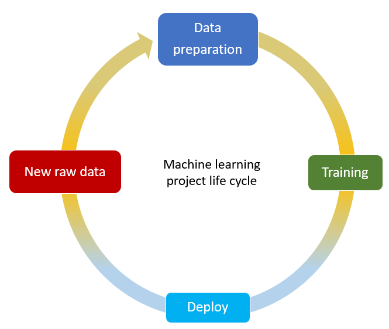
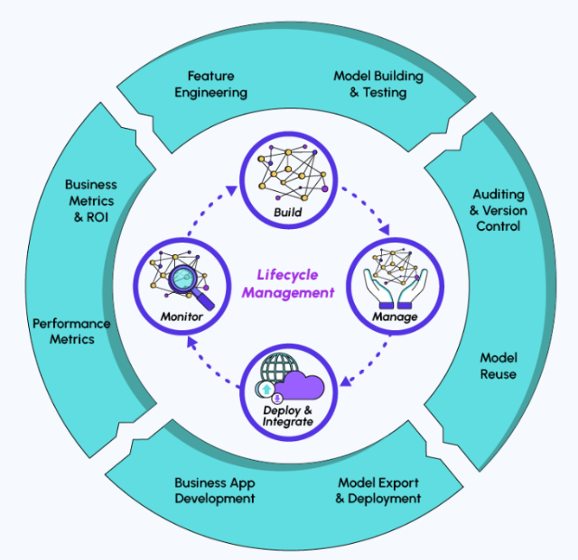

# Ensuring Data Integrity and Continuity for Machine Learning Projects

## Introduction 
In a typical Machine Learning project, the final implemented solution should provide automated training and implementation of the selected models. This is where CI/CD comes into play: This continuous integration / continuous deploying solution provides an end-to-end pipeline that completes the cycle of a full project and ensures the model's performance. Initially, Continuous Integration and Deployment is a DevOps technique to implement an automated pipeline for production's sake by:
- streamlining (rationalization)
- testing
- deploying/ production

The DevOps field corresponds to a collection of processes that tries to reduce the development life cycle of a system by enabling the continuous delivery of high-quality software. 

MLOps, on the other hand, is the process of automating and industrializing machine learning applications and workflows. CI/CD represents here an automation workflow of the ML pipeline through the following operations:
- building the model
- testing
- deploying

This also prevents the data scientist to take care and worry about this process, by ensuring no human negligence and constant improvement of the model efficiency by permanent monitoring of the ML model. Any change in the model construction is thus eased and its development automated with reliable delivery.

As the CI/CD workflow will automate the different steps of an ML project, let's do a quick reminder about the typical lifecycle of an ML project.

 

- **Data preparation:** In most cases, the data is initially presented in raw form. For this reason, it is necessary to perform a few steps of preprocessing these data sets to make them usable for the modeling step. This step is generally performed by the Data Scientist or sometimes by the Data Analyst and may require the use of tools such as Apache Spark, MySQL or Python, and libraries such as Pandas or Numpy.
- **Model Training:** This step led by the Data Scientist is the main focus of the project life cycle: the purpose of the model implementation is to respond to a specific problem by designing and setting the appropriate algorithm. This iteration usually requires the import of tools such as TensorFlow, PyTorch frameworks, or the library Scikit-Learn.
- **Model Deploying:** Once the model is ready, the Machine Learning Engineer or the Data Engineer is intended to make it available to the customer for easy and convenient use.
- **New raw data:** Although the project may be expected to be coming to an end, very often the Data Engineer receives new raw data available after these steps. They must therefore be integrated into the cycle described above to refine and improve the model performance developed previously.

## Understanding CI/CD
Each phase of the project lifecycle is associated with at least one process: CI, CD or both. Let's dive into their meaning.

- **Continuous Integration (CI):** CI stands for Continuous Integration. This practice gathers software engineering concepts around automating the building and testing of the model, version control, and release. By release, we here explicitly mean the action of pushing the code to the corresponding GitHub repository.
- **Continuous Delivery (CD):** CD stands for Continuous Delivery or Continuous deployment. This concept represents the continuous model deployment, the formatting, and the setup of a production-like environment to allow for automated integration. Regarding the application, the CD stage includes the testing, deployment, and automated configuration of the app.

## Key Components of CI/CD:

- **Version Control System (VCS):** Centralized systems like Git enable collaborative development by managing code changes.
- **Automated Builds:** Tools like Jenkins or Travis CI automate the build process, creating executable code from source files.
- **Automated Testing:** Automated testing frameworks (e.g., JUnit for Java) ensure code quality by identifying bugs and issues early in the development cycle.
- **Deployment Automation:** Tools such as Docker and Kubernetes automate the deployment process, ensuring consistency across different environments.

## Benefits of CI/CD:

- **Faster Development Cycles:** Automated processes reduce manual errors and accelerate the development lifecycle.
- **Improved Code Quality:** Automated testing and continuous monitoring enhance code reliability.
- **Reduced Deployment Risks:** Incremental updates and automated rollbacks minimize the impact of failed deployments.
- **Enhanced Collaboration:** CI/CD fosters collaboration among development and operations teams, leading to more efficient workflows.

## CI/CD in Machine Learning:
Continuous Integration and Deployment (CI/CD) has long been a common practice for the majority of software systems. By offering continuous and automatic training and application of Machine Learning models, machine learning systems may do the same thing.

Machine learning applications that use CI-CD offer a complete pipeline that closes the feedback loop at every level and maintains the performance of ML models. It can also bridge the gap between scientific and engineering processes by removing obstacles between data, modeling, processing, and return.

Detail of every step of the  typical lifecycle management of a machine learning project and its link with CI/CD: 



### Example

**Example: Customer Behavior Prediction Model**

Imagine a scenario where an e-commerce company wants to develop a machine learning model to predict customer behavior, specifically the likelihood of a customer making a purchase. The dataset includes information about customer demographics, browsing history, past purchases, and time spent on the website.

**Project struncture:**
Assume the following project structure:
- customer_behavior_prediction/
  - src/
    - model.py
  - tests/
    - test_model.py
  - build.py
  - requirements.txt


**Steps in Continuous Integration and Continuous Deployment (CI/CD) for Customer Behavior Prediction Model:**

**1. Continuous Integration (CI):**
   
   * **Version Control:**
      - Developers work on separate branches for different features or improvements in the model.
      - They use a version control system (e.g., Git) to manage changes collaboratively.
        - **Initialize a Git repository:** ```git init```
        - **Create a `.gitignore` file to exclude unnecessary files from version control:** ```touch .gitignore```
        - **Add and commit the changes:** 
            ```
            git add .
            git commit -m "Initial commit"
            ```
        - **Create a GitHub repository and push your code:**
            ```
            git remote add origin <your-github-repository-url>
            git branch -M main
            git push -u origin main
            ```
   * **Automated Testing:**
      - Unit tests and integration tests are written to verify the correctness of individual model components and their interactions.
      - Developers commit changes regularly, triggering automated tests to identify any integration issues early in the development process.
        - **Install `pytest`:** `pip install pytest`
        - **Write a simple test in a file named `test_model.py`:**
          ```
          # tests/test_model.py

            from src.model import predict_customer_behavior

            def test_prediction():
                # Assuming predict_customer_behavior is a function in your model
                prediction = predict_customer_behavior(sample_input)
                assert prediction in [0, 1]  # Adjust based on your model's output
          ``` 
        - **Run the test:** `pytest`

   * **Build Automation:**
      - An automated build system (e.g., Jenkins) compiles the model code, creating an executable version of the predictive model.
        - **Create a file named `model.py`:**
            ```
            # src/model.py

            def predict_customer_behavior(input_data):
                # Replace this with your actual model prediction logic
                # For simplicity, let's assume the model predicts 1 if spending > $100, otherwise 0
                return 1 if input_data['spending'] > 100 else 0
            ```
        - **Build Script (build.py):** 
            This script will be used by continuous integration tools like Jenkins or CircleCI to build the project.
            ```
            # build.py

            def build():
                # Replace this with your actual build logic
                # In this example, we might want to install necessary dependencies
                # and potentially perform other build steps if needed
                print("Building the Customer Behavior Prediction Model...")
                # Add any other build steps as required
            ```

    * **Requirements File (requirements.txt):**
        ```
        # requirements.txt

        numpy==1.21.0
        pytest==6.2.4
        # Add any other dependencies required for your project
        ```
    * **Run the build script:** `python build.py`

    * **Automating CI with GitHub Actions:**
        Now, let's set up GitHub Actions for automated CI. Create a ``.github/workflows/ci.yml` file:
        ```
        name: CI
        on:
        push:
            branches:
            - main

        jobs:
        test:
            runs-on: ubuntu-latest

            steps:
            - name: Checkout repository
            uses: actions/checkout@v2

            - name: Set up Python
            uses: actions/setup-python@v2
            with:
                python-version: 3.8

            - name: Install dependencies
            run: |
                pip install -r requirements.txt
                pip install pytest

            - name: Run tests
            run: pytest

            - name: Build model
            run: python build.py
        ```
        This GitHub Actions workflow will be triggered on every push to the main branch, running your tests and build script.

    > Replace the placeholder logic in the test script (test_model.py), model script (model.py), and build script (build.py) with your actual machine learning model, test logic, and any necessary build steps.


**2. Continuous Deployment (CD):**

   * **Staging Environment:**
      - Upon successful integration and testing, the model is deployed to a staging environment.
      - In this controlled setting, the model's performance is assessed using a subset of real data to simulate real-world conditions.

   * **Automated Acceptance Tests:**
      - Automated acceptance tests are conducted to evaluate the model's accuracy, precision, and recall in the staging environment.
      - These tests confirm that the model behaves as expected and meets predefined performance criteria.

   * **Deployment to Production:**
      - Once the model passes all tests in the staging environment, it is automatically deployed to the production environment.
      - The deployment process includes updating the live model with the new version, ensuring a seamless transition.

**3. Continuous Monitoring and Rollback:**

   * **Performance Monitoring:**
      - Continuous monitoring tools (e.g., Prometheus) track the model's performance in real-time.
      - Metrics such as accuracy, response time, and error rates are continuously monitored to detect any anomalies.

   * **Alerts and Notifications:**
      - Automated alert systems notify the development team of any significant deviations from expected performance.
      - Alerts may trigger interventions or investigations to address issues promptly.

   * **Automated Rollback:**
      - If the model's performance degrades beyond acceptable thresholds, an automated rollback mechanism is initiated.
      - The system reverts to the previous version of the model to maintain service reliability while the issue is investigated.

**Conclusion:**

Continuous Integration and Continuous Deployment ensure that the customer behavior prediction model undergoes a seamless and controlled development, testing, and deployment process. By automating key steps and implementing continuous monitoring, the e-commerce company can maintain a reliable and high-performing predictive model, adapting to changing customer behaviors effectively. The CI/CD pipeline provides a structured framework to enhance the agility and robustness of the machine learning model in response to evolving customer dynamics.