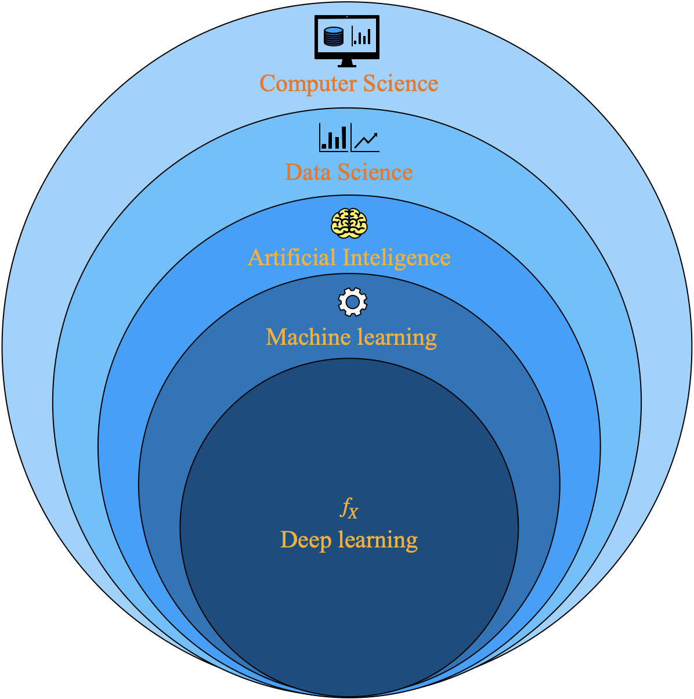

# Table of contents
<!--ts-->
   * [Introduction to Machine learning](#introduction-to-machine-learning)
      * [Analytics](#analytics)
      * [Categories of ML algorithms](#categories-of-ml-algorithms)
      * [A typical ML algorithm uses the following steps](#a-typical-ml-algorithm-uses-the-following-steps)
      * [Framework for develping ML models](#framework-for-develping-ml-models)
   *  [Python](https://github.com/arunsinp/Python-programming)
      * [Google colab help](https://github.com/arunsinp/Python-programming/blob/main/Python-fundamental/google-colab-help.ipynb)
      * [Python OS and filesystem](https://github.com/arunsinp/Python-programming/blob/main/Python-fundamental/python-os-and-filesystem.ipynb)
      * [First steps with python](https://github.com/arunsinp/Python-programming/blob/main/Python-fundamental/0.first-steps-with-python.ipynb)
      * [Python variables and data types](https://github.com/arunsinp/Python-programming/blob/main/Python-fundamental/1.python-variables-and-data-types.ipynb)
      * [Python conditionals and loops](https://github.com/arunsinp/Python-programming/blob/main/Python-fundamental/2.python-conditionals-and-loops.ipynb)
      * [Python functions and scope](https://github.com/arunsinp/Python-programming/blob/main/Python-fundamental/3.%20python-functions-and-scope.ipynb)
      * [Numpy](https://github.com/arunsinp/Python-programming/blob/main/Python-fundamental/NUMPY.ipynb)
   * [Python and data science](#python-and-data-science)
      * [Core Python Libraries for Data Analysis](#core-python-libraries-for-data-analysis)
      * [Descriptive statistics](#descriptive-statisctics)
      * [Probability distributions and hypothesis testing](#probability-diestributions-and-hypotehsis-testing)
      * [Linear Regression](#linear-regression)
      * [Advanced machine learning](#advanced-machine-learning)
   *  [References](#reference)
<!--te-->

## Machine learning tools
- Development
  - PyCharm
  - VScode
  - Jupyter
 
- Training 
  - PyTorch Lightning
  - Scikit-Learn
  - TensorFlow
  - LightGBM
  - XGBoost
  - PyTorch

- Tuning
  - Keras tune
  - Hyperopt
  - Optuna
 
- Optimization
  - SparseML

- Development / packaging
  - Hugging Face Endpoints
  - DeepSparse
  - Torch Serve
  - ONNX
  - TFX 

- Visualization 
  - Matplotlib
  - Seaborn
  - Kangas
  - Plotly

<!---------------------------- Reference ------------------------------>
# Reference

1. Machine learning using python, Manarajan Pradhan, U Dinesh Kumar
2. Please follow lecture series provided at [Jovian.ml](https://jovian.ai/), i.e. [Data Analysis with Python: Zero to Pandas](https://jovian.ai/learn/data-analysis-with-python-zero-to-pandas)
3. [Python roadmap](https://roadmap.sh/python/)
4. [Python tutorials at w3school](https://www.w3schools.com/python/default.asp)
5. [30 Days of Python](https://github.com/asabeneh/30-days-of-python)
6. [Python official documents](https://docs.python.org/3/tutorial/)
7. [Data science roadmaps](https://github.com/codebasics/py/blob/master/TechTopics/DataScienceRoadMap2020/data_science_roadmap_2020.md)
8. Statistics, Murray R. Spiegel, Larry J. Stephens
